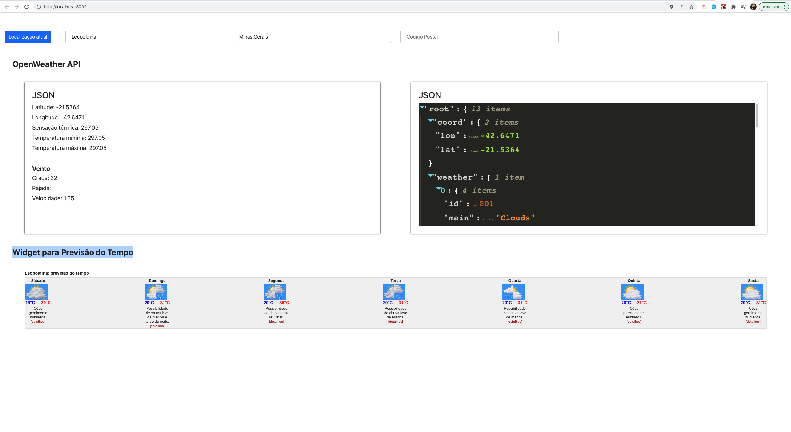

# Baixando e instalando o projeto

1 - git clone git@github.com:thayscorrea/builders.git
2 - Navegue até o diretório que você clonou o projeto (etapa 1)
3 - npm install (Para instalar as dependências do projeto)
4 - npm start

## Recursos utilizados

### Geolocation Navigator

Recurso usado para pegar a latitude e longitude do usuário através do navegador. Para isso é necesário permitir o acesso que o navegador irá solicitar no compilar o projeto.

### OpenWeather API

API utilizada para pegar o clima da sua localização, usando a latitude e longitude resgatada pelo Geolocatopm Navigator. 

Link da API: https://openweathermap.org/api

### Widget para Previsão do Tempo

Esse script faz a mesma função do OpenWeather API, contudo ele traz uma interface mais amigável, por isso foi incorporado no projeto.

Link do script: https://www.tititudorancea.com/z/script_previsao_do_tempo_widget_gratis.htm

### BigDataCloud’s Free Client-Side Reverse Geocoding API

Essa API foi usada para converter a latitude e longitude para o endereço (cidade, estado e código postal). Antes desta implementação, foi implementado a API do Google que se encontra até comentada no arqvuio App.js linha 52. Contudo, houve um problema com o token do Google e com isos não foi possível obter o valor final desejado.

Link da API: https://www.bigdatacloud.com/geocoding-apis/free-reverse-geocode-to-city-api?gclid=CjwKCAiAg6yRBhBNEiwAeVyL0AUyK5uNN5CsvDd58UN5m3IgNKpMBHO3P5rQEkBdb3Jt4BhE30BJxxoCR6QQAvD_BwE

### Print da tela do sistema em funcionamento

